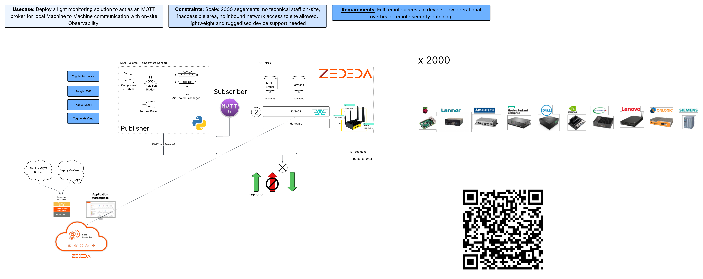

# MQTT Pub/Sub Demo 

1. Deploy the paulc-MQTT application on GMWTUS
2. Record the IP address
3. Modify the config.json file with the correct IP address
4. Deploy Grafana VM
5. Create the MQTT data connector in Grafana with the correct parameters
6. Add the dashboard via JSON file in this repo
7. Run the mqttpub python script and check Grafana is getting the data
8. Run the mqttsub python script to show that we have subscribed to the correct topic.

The python script is leveraging paho-mqtt https://pypi.org/project/paho-mqtt/#installation

## Prerequisites
---
pip install paho-mqtt
